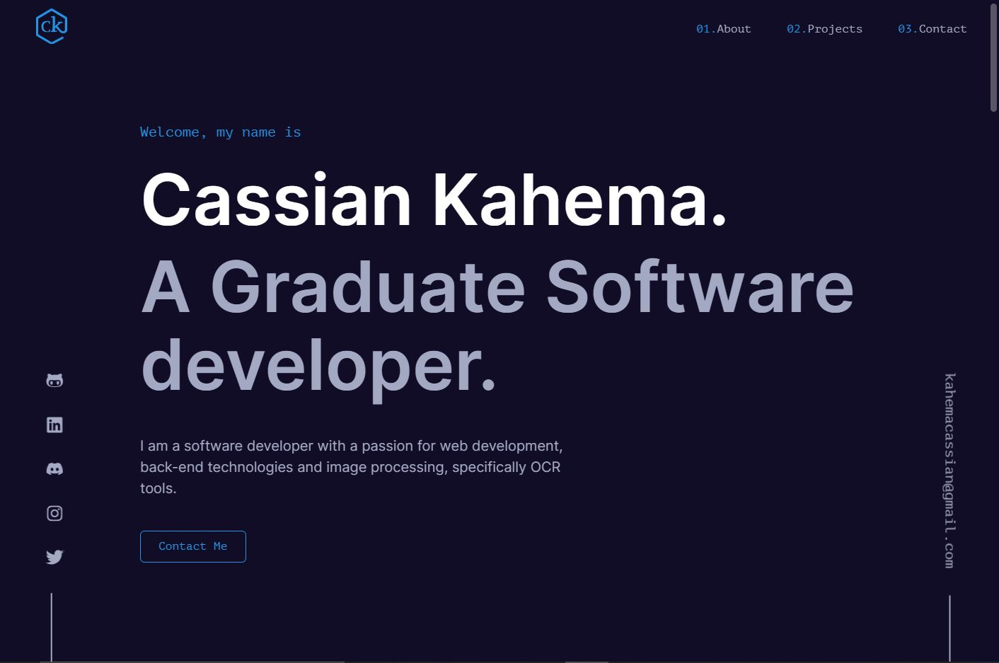

# [My Personal Portfolio](https://cassiankahema.com)

A portfolio ([cassiankahema.com](https://cassiankahema.com)) I made based off of Brittany Chiang's design.

I used ReactJs, Vite and other react popular libraries to optimize the development process.

## TODO

- ~~hamburger menu for small screen sizes~~

  - ~~a veil that pops out when menu is active~~
  - ~~veil dissappears when menu is not longer active~~
  - ~~Menu icon animation~~

- ~~Smooth scrolling on clicking nav links~~

- Nav bar animation

- ~~Footer (tech used)~~

- Animations :

  - Page load (logo animation)
  - components load

- Different logo sizes and variation

- Light/Dark Mode Switch
